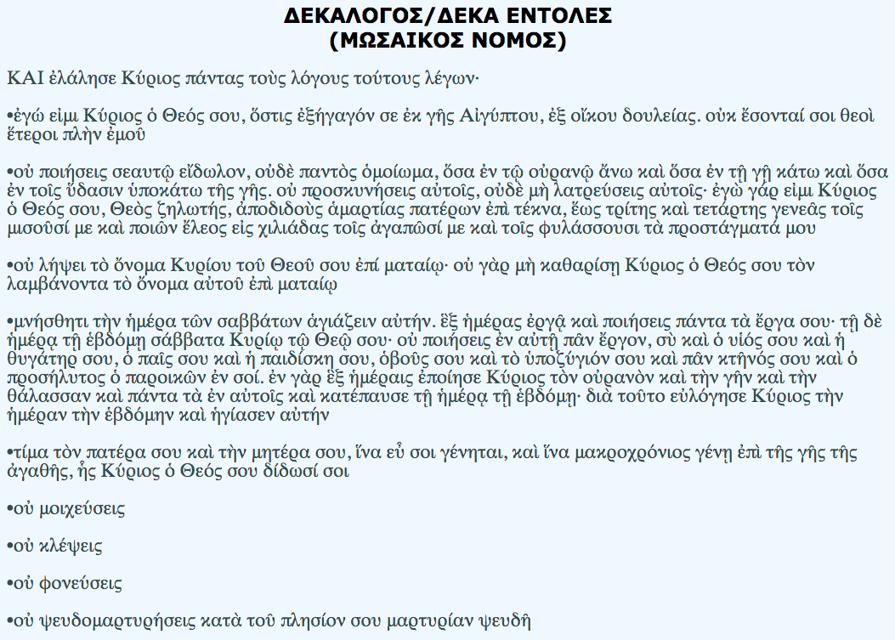

Η εφαρμογή αυτή περιέχει τις δέκα εντολές οι οποίες παραδόθηκαν στον Μωυσή από τον Θεό στο όρος Σινά χαραγμένες σε δύο πέτρινες πλάκες.

Οι εντολές αυτές αποτέλεσαν τη βάση ενός ολόκληρου κώδικα ηθικής και θρησκείας, πολιτικής και κοινωνικής οργάνωσης.

Το απόσμασμα κειμένου που αναφέρεται στην εφαρμογή προέρχεται από την Παλαιά Διαθήκη (Έξοδος 20:1-17)

